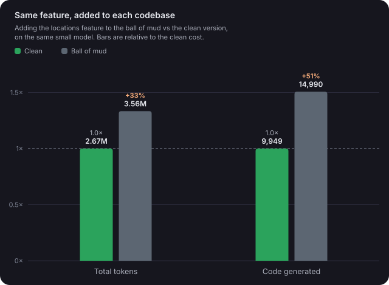
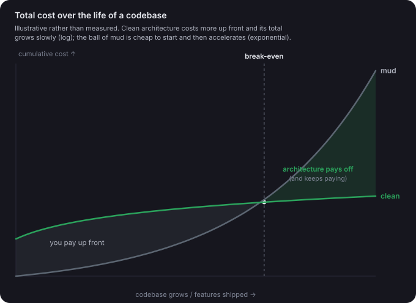

<p align="center">
  
</p>

# BurnPlan

BurnPlan is a project tuning tool for repositories maintained by humans and coding agents.

Skyhook tells an agent where to read. BurnPlan adds the longer-lived layer around that map. It captures project intent, architecture direction, code health evidence, team routing, generated documentation proposals, and a record of what agents changed and why.

## The Problem

A code map is useful, but it does not answer enough by itself.

Agents also need to know:

- what the product is supposed to do
- which architecture choices are intentional
- which docs are missing, stale, or scattered
- where churn and coupling suggest weak spots
- which team or subagent should handle a class of work
- what previous agents changed and why they made those choices

Without that context, every session starts from the same shallow scan. Work may still get done, but the repository does not get easier to work in over time.

## How BurnPlan Solves It

BurnPlan consumes or refreshes a Skyhook map, then writes a project ratchet under `.burnplan/`.

The core artifacts are:

- `.burnplan/onboarding.md`: product, architecture, goals, risks, and documentation preferences
- `.burnplan/quality.md`: lightweight churn, coupling, volatility, and static-analysis evidence
- `.burnplan/agent-prompts.md`: slim pre-work guidance agents read before working
- `.burnplan/agent-rules.json`: behavioral rules distilled from accumulated worklog entries
- `.burnplan/behavior-evidence.json`: transcript-derived behavior snapshot written by `burnplan behavior sync`
- `.burnplan/doc-synthesis.json`: cached model-written architecture/design drafts with input fingerprint
- `.burnplan/documentation-ledger.md`: known documentation inventory and gaps
- `.burnplan/proposals/docs/`: reviewable architecture, design, testing, code health, improvement backlog, agent rules, and ADR drafts
- `.burnplan/proposals/agents/`: reviewable agent team definitions and Claude Code hook config
- `.burnplan/worklog/`: what changed
- `.burnplan/rationale/`: why it changed

Agent-facing guidance stays small. `agent-prompts.md` holds a short read-first
list and two checklists, and `burnplan optimize` reports its size against a
configurable line budget. Improvement suggestions live in the reviewable
`proposals/docs/improvement-backlog.md` instead of the pre-work path, so agents
are not handed side quests before starting a task.

This posture follows the published guidance for Claude 5-generation models
([context engineering](https://claude.com/blog/the-new-rules-of-context-engineering-for-claude-5-generation-models),
[Opus 5 prompting](https://platform.claude.com/docs/en/build-with-claude/prompt-engineering/prompting-claude-opus-5)):

- slim pointer files over preloaded blobs
- just-in-time route packs
- auto-distilled rules instead of hand-maintained instruction files
- no verification ceremony in generated subagent instructions (current models
  verify their own work; telling them to do it again wastes tokens)

Default subagents also carry an `effort` hint in `teams.json` (planning roles
`high`, execution and review roles `medium`). The hint is orchestrator-facing
data, not a Claude Code frontmatter field.

BurnPlan is review-first. It writes proposals under `.burnplan/proposals/` and only copies them into human-owned docs or agent directories when you run `burnplan promote`.

## Why It Works This Way

Generated documentation should not become project truth just because a tool wrote it. BurnPlan keeps generated proposals separate until someone reviews them.

The ratchet is file-based because it needs to work in normal local repos, CI runners, and agent harnesses without a database or service. Files can be committed, reviewed, diffed, edited, or ignored.

The quality analysis is lightweight. BurnPlan looks for useful signals such as churn, co-change coupling, volatile areas, static-analysis configuration, and missing architecture docs. It points agents toward weak spots and does not replace deeper analysis.

The team model is also plain data. BurnPlan ships with opinionated Product Owner and Project Manager teams, but users can edit `.burnplan/teams.json` or supply their own mapping.

## Benchmarks

The measured chart comes from adding the same feature to two versions of the
same small Android app, a clean layered version and a single God-Activity ball
of mud, with the same small model doing the work. The mud cost about a third
more total tokens and made the model generate about half again as much code.



The second chart is the mental model behind the ratchet, illustrative rather
than measured. Clean architecture costs more up front and then its total grows
slowly; the mud is cheap to start and then the cost of every change keeps
accelerating. The ratchet is there to keep agent output on the clean curve.



## Relationship To Skyhook

Use Skyhook for fast wayfinding:

- `.skyhook/INDEX.md`
- `.skyhook/map.md`
- `.skyhook/map.json`
- `.skyhook/docs.md`
- `.skyhook/architecture.md`
- `.skyhook/routes/`

Use BurnPlan for the ratchet:

- onboarding and project intent
- quality and weak-point evidence
- documentation proposals
- agent team definitions
- worklog and rationale entries
- routing teams through Skyhook profiles

BurnPlan imports Skyhook. When `burnplan onboard` or `burnplan optimize` runs, it can refresh `.skyhook/` first and then build BurnPlan artifacts from the current map.

## Install

From PyPI (the package is `burnplan`; the Skyhook dependency installs with it
as `skyhook-graph`):

```sh
python3 -m pip install burnplan
```

From sibling checkouts:

```sh
python3 -m pip install -e ../Skyhook -e .
```

From another repository or a remote runner:

```sh
python3 -m pip install \
  "git+https://github.com/KalebKE/Skyhook.git" \
  "git+https://github.com/KalebKE/BurnPlan.git"
```

Run without installing by adding Skyhook to `PYTHONPATH`:

```sh
PYTHONPATH=../Skyhook python3 -m burnplan --help
```

## First Setup

From the repository you want to tune:

```sh
burnplan onboard
```

In automation or when you want a noninteractive first pass:

```sh
burnplan onboard --provider static --no-interview
```

Initialize editable team behavior mappings:

```sh
burnplan teams init
```

Review the generated files under `.burnplan/proposals/`. When the proposed docs are good enough to become project docs:

```sh
burnplan promote docs
```

When the proposed agent specs are good enough to install:

```sh
burnplan promote agents
```

Promotion refuses to overwrite existing files unless `--force` is supplied. Use
`--skip-existing` to promote only files whose destination does not exist yet.
That is useful when a repo already has human-owned docs (including
case-colliding names like `ARCHITECTURE.md` on case-insensitive filesystems)
that must never be overwritten. The two flags are mutually exclusive.

Use `--only <name>` (repeatable; basename or repo-relative path) to promote a
single reviewed file:

```sh
burnplan promote docs --only architecture.md --force
```

This is the intended path for replacing a human-written doc with a generated
one you have reviewed. It promotes one file, named explicitly, instead of
force-overwriting everything at once. On case-insensitive filesystems the write
lands in the existing file (e.g. `ARCHITECTURE.md` keeps its name but receives
the reviewed content). `--only` skips the Claude hooks merge; run a plain
`promote agents` for that.

## Configuration

Optional BurnPlan config lives at `.burnplan/config.yaml`.

```yaml
version: 1
outputDir: .burnplan
mapDir: .skyhook
quality:
  sinceDays: 90
  maxCommits: 1000
guidance:
  maxLines: 120
```

`guidance.maxLines` is the budget for `.burnplan/agent-prompts.md`. When the rendered
guidance exceeds it, `onboard` and `optimize` print a warning to stderr. The warning
never changes exit codes, so CI dry-run gates are unaffected.

Optional Skyhook config lives at `.skyhook/config.yaml`.

```yaml
version: 1
outputDir: .skyhook
model:
  provider: auto
  model: auto
scan:
  include:
    - .
  exclude:
    - build
    - dist
    - node_modules
    - .git
    - .gradle
    - .burnplan
  maxFiles: 5000
docs:
  extraGlobs:
    - "docs/**/*.md"
    - "adr/**/*.md"
    - "architecture/**/*.md"
    - "**/*ADR*.md"
    - "**/*C4*.md"
```

The YAML parser supports a small subset. Neither Skyhook nor BurnPlan requires PyYAML.

## Model Provider

BurnPlan delegates repository mapping to Skyhook. Skyhook supports an OpenAI-compatible chat completions endpoint through the Python standard library.

Skyhook reads these environment variables:

- `OPENAI_API_KEY` or `SKYHOOK_API_KEY`
- `OPENAI_BASE_URL` or `SKYHOOK_BASE_URL`
- `SKYHOOK_MODEL`

If no API key is available and provider is `auto`, Skyhook uses static mode. That keeps BurnPlan usable on local machines and remote runners.

Rule distillation (below) uses the same provider resolution. The model is only consulted
on write paths when a key resolves; `--dry-run` and static CI runs never call the model.

## Commands

### `burnplan onboard`

Run this when introducing BurnPlan to a repo or when the project direction has changed enough that the old onboarding notes are misleading.

```sh
burnplan onboard
```

When attached to a terminal, BurnPlan asks about functional requirements, non-functional requirements, architecture intent, short-term goals, long-term goals, risk areas, and documentation preferences.

For a noninteractive pass:

```sh
burnplan onboard --provider static --no-interview
```

### `burnplan optimize`

Run this before committing, opening a PR, or handing work to another agent:

```sh
burnplan optimize
```

It refreshes the Skyhook map, quality evidence, onboarding guidance, agent prompts, documentation ledger, and proposal drafts.

Use dry-run as a gate:

```sh
burnplan optimize --dry-run
```

Dry-run exits `1` when generated artifacts would change and `0` when they are current.

### `burnplan document`

Run this when an agent finishes material work:

```sh
burnplan document \
  --area sync \
  --what "Added retry handling" \
  --why "Transient failures should be explicit and recoverable."
```

It writes separate entries:

- `.burnplan/worklog/<timestamp>-<slug>.md`
- `.burnplan/worklog/<timestamp>-<slug>.json`
- `.burnplan/rationale/<timestamp>-<slug>.md`
- `.burnplan/rationale/<timestamp>-<slug>.json`

Use `--from-git` to fill `--what` from local git status and diff stats. `--why` is still required.

### `burnplan behavior sync`

Run this to capture how agents behaved in this repository:

```sh
burnplan behavior sync
```

It scans the repository's Claude Code session transcripts under
`~/.claude/projects/` and writes `.burnplan/behavior-evidence.json` with the
measured signal. The one signal today is edits without a prior read: an edit
to a file whose path is not among the session's last 20 read paths. Codex
rollouts are not scanned because edit detection there is too approximate to
trust. Worktree and subdirectory sessions are not counted.

Scanning never happens during `onboard` or `optimize`. Those commands read
the committed snapshot only, so the dry-run gate stays deterministic and CI
runners without `~/.claude` are unaffected. Re-running sync with unchanged
transcripts leaves the file byte-identical.

When the measured rate clears `behavior.editsWithoutReadThreshold` (default
25%) over at least 20 edits, distillation adds a rule carrying the
measurement, with `behavior-evidence` as its source. With a model key, the
snapshot is also handed to the model as labeled evidence. Configure the
window and threshold in `.burnplan/config.yaml`:

```yaml
behavior:
  windowDays: 90
  editsWithoutReadThreshold: 25
```

### Existing documentation is incorporated

Generated proposals are built from your existing docs instead of alongside them.
During `onboard` and `optimize`, BurnPlan reads the repository's high-priority
docs (readme, architecture, design, C4, ADR kinds from the Skyhook inventory)
and incorporates them:

- Always (deterministic): the generated `architecture.md` and `design.md`
  proposals carry an "Existing Documentation" section with each human doc's
  lead paragraph and section outline, and state that the human docs remain
  canonical.
- With a model key: the architecture and design proposals are synthesized
  whole from the full text of those docs plus the code map and captured
  intent, so a reviewed proposal can earn the right to replace the human doc
  via `promote docs --only <file> --force`. Drafts are cached in
  `.burnplan/doc-synthesis.json` behind a fingerprint of the doc contents,
  map digest, and intent. Unchanged inputs reuse the cached bytes, dry-run
  never calls the model, and `--refresh-docs` forces re-synthesis.

Worklog entries also feed rule distillation: `burnplan onboard` and `burnplan optimize`
mine accumulated entries into at most 18 behavioral rules with provenance links back to
the source entries. The result is cached in `.burnplan/agent-rules.json`, keyed by a
fingerprint of the entry ids, so reruns with unchanged entries reuse the previous rules
byte-for-byte and the `optimize --dry-run` ratchet stays stable. A reviewable rendering
lands in `.burnplan/proposals/docs/agent-rules.md`; after `burnplan promote docs`, the
promoted `docs/agent-rules.md` joins the agent-prompts read-first list on the next
optimize. With a model key available, rules are synthesized by the model; otherwise a
deterministic static distiller groups entries by area and recurring rationale terms.
Pass `--refresh-rules` to force re-distillation despite unchanged entries. Rules whose
area stops appearing in recent entries are marked `stale` so they can be retired.

### `burnplan teams init`

Write the default Product Owner and Project Manager team mapping:

```sh
burnplan teams init
```

The default preset maps:

- `product-owner story` to `product_planning`
- `product-owner requirements` to `requirements_planning`
- `project-manager breakdown` to `technical_breakdown`
- `project-manager implement` to `implementation`
- `project-manager review` to `code_review`
- `project-manager bugfix` to `bug_hunt`

The default subagents cover product stories, requirements, acceptance criteria, technical breakdowns, implementation, code review, and bug hunting. Edit `.burnplan/teams.json` when your organization wants different names, behaviors, or route profiles.

### `burnplan assign`

Route a task through a team behavior:

```sh
burnplan assign \
  --team project-manager \
  --behavior implement \
  --task-file issue.md
```

BurnPlan resolves the behavior to a Skyhook route profile, refreshes `.skyhook/` if needed, and prints a route pack.

Emit JSON for an orchestrator:

```sh
burnplan assign \
  --team product-owner \
  --behavior story \
  --task "Plan checkout retry handling" \
  --format json
```

Persist the generated route under `.skyhook/routes/`:

```sh
burnplan assign --team project-manager --behavior review --task-file pr-notes.md --save
```

### `burnplan promote`

Promote reviewed proposal drafts:

```sh
burnplan promote docs
burnplan promote agents
burnplan promote all
```

Documentation promotion writes to `docs/`, including architecture, design, code map, testing, code health, improvement backlog, distilled agent rules, agent operating model, and an initial ADR.

Agent promotion writes generic agent specs to `docs/agents/` and Claude-style subagent files to `.claude/agents/`. Generated Claude subagent files carry per-role `tools` allowlists (planning and review roles are read-only; implementer and bug-hunter get edit tools), editable via `.burnplan/teams.json`.

Agent promotion also wires Codex: it maintains a small marker-fenced BurnPlan block
in the repository's `AGENTS.md` (the file Codex loads automatically). The block is
small. It holds a pointer to `.burnplan/agent-prompts.md`, the route-pack command,
and one boundary about returning distilled summaries from subagents, following the
same progressive-disclosure posture as the Claude side
([Codex context guidance](https://learn.chatgpt.com/guides/best-practices)).
Architectural rules live in the files the block points at, loaded as needed, never
inlined into `AGENTS.md`. If the file is missing it is created; if it already has a
burnplan block, the content between the markers is replaced in place; nothing
outside the markers is ever touched.

Agent promotion also installs the proposed Claude Code Stop hook into `.claude/settings.json`. If the file does not exist it is created; if it exists, the hook entry is merged additively and idempotently. Existing user settings are never modified or removed, and re-promotion never duplicates the entry. If the existing file is not valid JSON, promotion fails with a manual-merge message. If a future BurnPlan version changes the generated hook command, remove the stale entry manually.

### `burnplan hook stop`

The generated Stop hook runs this command at the end of a Claude Code session:

```sh
burnplan hook stop
```

It prints a one-line reminder when the working tree has changes that no worklog entry documents (nothing newer than the last commit), and stays silent otherwise. It always exits 0 and never blocks the session. It is cheap (two git calls and a directory listing) rather than a full `optimize --dry-run`.

## When To Rerun

Run `burnplan onboard`:

- when adding BurnPlan to a repository
- after a significant product direction change
- after a major architecture change
- when existing onboarding notes are stale enough to mislead agents

Run `burnplan optimize`:

- before opening a PR
- before handing a repo to another agent session
- after a large refactor or module move
- after adding important docs, tests, or architecture decisions
- periodically after worklog and rationale entries accumulate

Run `burnplan document` after material agent work. It is most useful when the entry captures both what changed and why the approach was chosen.

Run `burnplan promote` only after reviewing proposals. Promotion is explicit because generated docs should not silently overwrite project truth.

## Upgrading Existing Repos

Repositories already initialized with an older BurnPlan pick up everything on the next
`burnplan optimize`: `.burnplan/*` artifacts and proposals regenerate in place (the
first dry-run after upgrading will report changes; that is the ratchet working).
Already-promoted files in `docs/`, `docs/agents/`, and `.claude/agents/` do not
auto-update. Review the refreshed proposals, then selectively
`burnplan promote docs --force` or `burnplan promote agents --force`. Run
`burnplan promote agents` once to install the Claude Code Stop hook.

## Quality Evidence

BurnPlan currently mines lightweight evidence from git history:

- hotspots from recent churn
- repeated file co-changes as coupling hints
- volatile top-level areas
- detected static-analysis configuration
- documentation weak points such as missing ADRs or architecture docs

It discovers static-analysis tools but does not execute them yet.

## CI Example

Use dry-run when generated artifacts are expected to be current:

```yaml
name: burnplan

on:
  pull_request:

jobs:
  optimize-check:
    runs-on: ubuntu-latest
    steps:
      - uses: actions/checkout@v4
      - uses: actions/setup-python@v5
        with:
          python-version: "3.11"
      - run: python3 -m pip install burnplan
      - run: burnplan optimize --provider static --dry-run
```

## Development

```sh
PYTHONPATH=../Skyhook python3 -m unittest discover -s tests -v
PYTHONPATH=../Skyhook python3 -m burnplan onboard --provider static --no-interview --dry-run
PYTHONPATH=../Skyhook python3 -m burnplan optimize --provider static --dry-run
PYTHONPATH=../Skyhook python3 -m burnplan assign --team project-manager --behavior implement --task "add retry handling"
PYTHONPATH=../Skyhook python3 -m burnplan onboard --provider static --no-interview
PYTHONPATH=../Skyhook python3 -m burnplan promote docs
```
